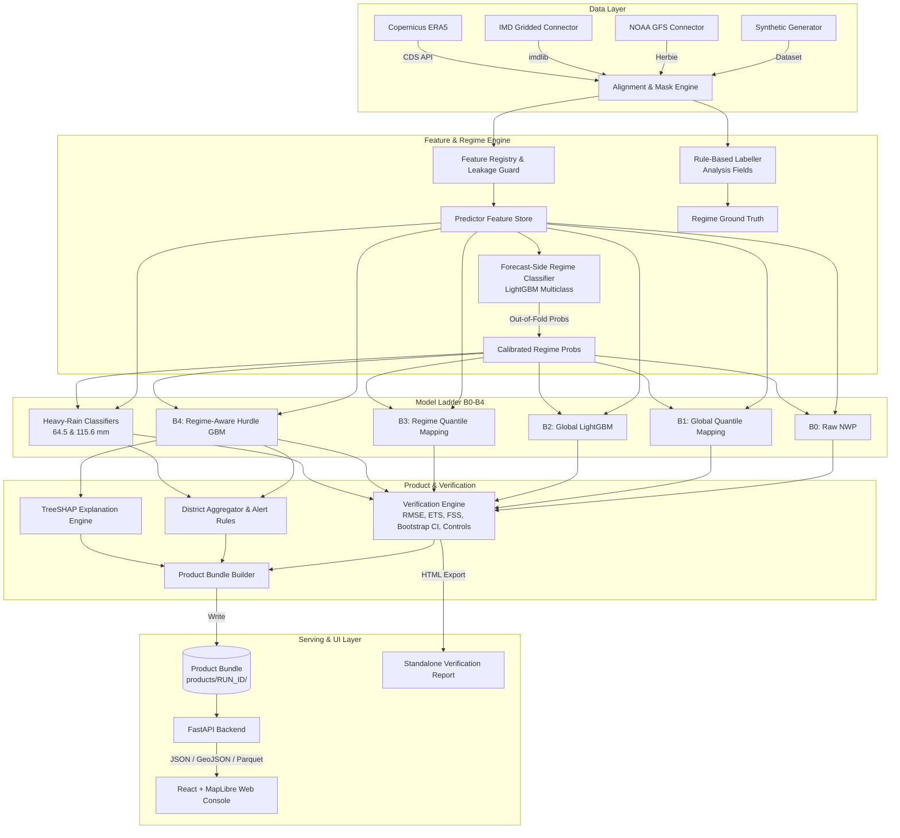
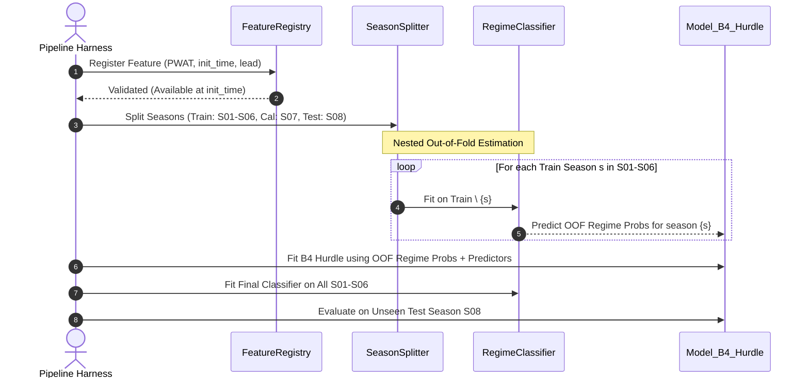

# System Architecture: Project Varsha

**System Identifier:** Varsha Core Pipeline  
**Version:** 1.0.0

---

## 1. High-Level Architecture Overview

Varsha operates as a decoupled, static-first ML post-processing pipeline. Heavy computational stages (data alignment, feature engineering, model training, verification) produce self-contained, immutable **Product Bundles** (`products/<run_id>/`). A lightweight FastAPI service reads and serves these bundles to the client-side React cartography console.



---

## 2. Pipeline Subsystems

### 2.1 Data Ingestion & Alignment Layer (`src/varsha/data/`)
- **Polymorphic Ingestion:** Uniform abstraction `DataIngestor` yielding `xarray.Dataset` with standardized variable keys:
  - Forecast: `(init_time, lead_day, lat, lon)`
  - Observation: `(valid_day, lat, lon)`
- **Spatial Alignment:** Standardized Indian monsoon bounding box ($6.0^\circ\text{N} - 38.0^\circ\text{N}$, $68.0^\circ\text{E} - 98.0^\circ\text{E}$) on uniform $0.5^\circ$ (demo) or $0.25^\circ$ (full) grid with official land-sea mask.
- **Temporal Alignment:** Precise 24-hour accumulation window matching IMD convention ($03:00\text{ UTC} \rightarrow 03:00\text{ UTC}$ / $08:30\text{ IST} \rightarrow 08:30\text{ IST}$).

### 2.2 Feature Registry & Strict Leakage Guard (`src/varsha/features/`)
- **Metadata Enforcement:** Every feature is registered with provenance type (`forecast_valid`, `static`, `climatology`) and timestamp metadata.
- **Temporal Invariance Assertion:** Assert that $t_{\text{available}} \le t_{\text{initialisation}}$. Observations at or after initialisation time are strictly rejected.
- **Season Splitting:** Strictly year-based splits (e.g., Leave-One-Season-Out for CV, dedicated Calibration Season, untouched Test Season).



### 2.3 Model Ladder & Heavy Rain Engine (`src/varsha/models/`)
- **B0:** Identity baseline (raw NWP).
- **B1:** Cell-group empirical quantile mapping.
- **B2:** Global LightGBM regressor predicting precipitation amount directly without regime features.
- **B3:** Conditional quantile mapping indexed by predicted regime class.
- **B4 (Regime-Aware Hurdle):**
  - Stage 1 (Occurrence): Binary classifier $P(\text{rain} \ge 0.1\text{ mm})$.
  - Stage 2 (Amount): Quantile regressors ($\alpha \in \{0.10, 0.50, 0.90\}$) trained on positive precipitation samples, conditioned on predicted regime probabilities and dynamic circulation features.
- **Heavy Rain Probability ($P_{\ge 64.5}, P_{\ge 115.6}$):** Dedicated calibrated binary LightGBM models with isotonic calibration and monotonic sorting guarantees.

---

## 3. Product Bundle Directory Layout

Every pipeline execution generates a self-contained bundle under `products/<run_id>/`:

```text
products/SYN_S09_0715_demo/
├── manifest.json            # Config hash, git SHA, package versions, execution timings
├── controls_summary.json    # Positive & negative control validation outcomes
├── regime_probs.json        # Domain & regional regime probability vectors (Day-1..5)
├── districts.json           # District tabular forecasts, metrics, and alert statuses
├── districts.geojson        # Vector geometries with bundled forecast attributes
├── districts.csv            # Tabular export for offline analyst tooling
├── grid_layers.bin          # Quantized compact binary grid arrays (≤150 KB compressed)
├── explanations.json        # District-level grouped feature contributions (TreeSHAP)
├── verification.json        # Complete verification metrics (RMSE, ETS, CSI, FSS, CIs)
└── report.html              # Standalone, print-ready HTML verification report
```

---

## 4. API Endpoints Specification

FastAPI application serving both live and precomputed bundles:

| Method | Route | Output Format | Description |
|---|---|---|---|
| `GET` | `/healthz` | `application/json` | Healthcheck and service liveness |
| `GET` | `/api/v1/meta` | `application/json` | System metadata, active mode, boundaries status, controls |
| `GET` | `/api/v1/runs` | `application/json` | List available run bundles |
| `GET` | `/api/v1/runs/{run}/districts` | `application/json` | Queryable district forecast table by lead |
| `GET` | `/api/v1/runs/{run}/districts.geojson` | `application/geo+json` | District polygons with attached forecasts |
| `GET` | `/api/v1/runs/{run}/districts.csv` | `text/csv` | Downloadable CSV dataset |
| `GET` | `/api/v1/runs/{run}/grid` | `application/octet-stream` | Quantized grid layer by lead & variable |
| `GET` | `/api/v1/runs/{run}/regime` | `application/json` | Domain and zone regime forecast distribution |
| `GET` | `/api/v1/districts/{id}` | `application/json` | District Day-1..5 detail, timeline, and TreeSHAP explain |
| `GET` | `/api/v1/verification/summary` | `application/json` | Benchmark ladder scorecard & bootstrap CIs |
| `GET` | `/api/v1/verification/report` | `text/html` | Standalone HTML verification report |
