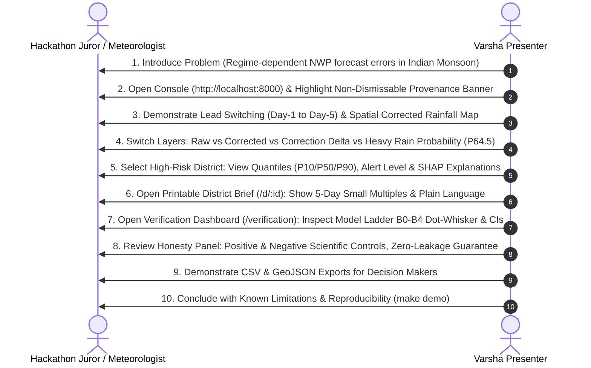

# Evaluator & Jury Demo Script: Project Varsha

**Document Reference:** Varsha 8–10 Minute Presentation & Evaluation Walkthrough  
**Version:** 1.0.0

---

## 1. 10-Minute Walkthrough Flow

---

## 2. Hard Questions & Honest Answers (Crib Sheet)

### Q1: "How do we know your AI isn't just smoothing out the forecast and hiding extreme events?"
**Answer:** "That is exactly why single global bias-correction fails, and why our verification focuses on threshold-specific skill. Look at our Fractions Skill Score (FSS) and Equitable Threat Score (ETS) at $\ge 64.5\text{ mm}$ and $\ge 115.6\text{ mm}$. In our model ladder, Model B4 (Regime-Aware Hurdle) specifically conditions on active/depression regimes where heavy tails occur, preserving sharp local gradients rather than damping them."

### Q2: "Did you use future observations to predict the regime?"
**Answer:** "No. We enforce this in code via our `FeatureRegistry` and nested out-of-fold cross-validation. The regime classifier uses only forecast-side circulation features available at initialisation time. Furthermore, B4 is trained strictly on out-of-fold regime probabilities, and our leakage canaries in CI fail if any future observation is introduced."

### Q3: "What do these synthetic verification results actually prove?"
**Answer:** "We are completely transparent on this: synthetic results demonstrate that our mathematical post-processing pipeline successfully recovers known dynamical regime biases and passes both positive and negative scientific controls under controlled ground truth. They prove architectural correctness and reproducibility, not operational atmospheric skill."

### Q4: "How does a district disaster management officer use this in an emergency?"
**Answer:** "A DDMO needs clarity in under 30 seconds. On the main console or the printable single-page District Brief, they get: (1) An indicative alert badge with explicit probability triggers, (2) Calibrated P10/P50/P90 rainfall amounts, and (3) The expected area fraction of their district exceeding heavy rainfall thresholds."
