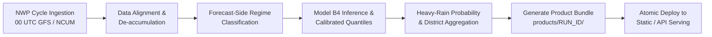

# Operational Runbook & Scheduling Guide: Project Varsha

**Document Reference:** Varsha Operational Runbook  
**Version:** 1.0.0

---

## 1. Daily Operational Workflow (Real-Data Mode)

For operational national meteorological centres, the post-processing pipeline executes following the availability of raw NWP cycles ($00:00\text{ UTC}$ and $12:00\text{ UTC}$):



---

## 2. Command Reference

### 2.1 Complete Synthetic Demo
```bash
# Execute end-to-end synthetic pipeline and launch server
make demo
```

### 2.2 Fast CI Profile Execution (< 2 mins)
```bash
# Execute fast coarse-grid pipeline and run test suites
make demo-fast
```

### 2.3 Individual Pipeline Stages (CLI)
```bash
# Generate synthetic dataset
python -m varsha.cli data synth --profile demo

# Run rule-based regime labelling
python -m varsha.cli label --config configs/regimes.yaml

# Train model ladder B0-B4 and heavy rain models
python -m varsha.cli train --config configs/models.yaml

# Execute verification and generate standalone HTML report
python -m varsha.cli verify --profile demo
python -m varsha.cli report --run-id SYN_S09_0715_demo

# Launch API server
python -m varsha.cli serve --port 8000
```

---

## 3. Failure Modes & Automatic Fallbacks

| Failure Scenario | Automated Diagnostic | Recovery & Fallback Action |
|---|---|---|
| **Missing Newest NWP Cycle** | `FetchError: Cycle 00Z not available on S3` | Pipeline automatically falls back to the previous cycle ($12\text{Z}$ of previous day) and attaches a `CycleFallbackWarning` to the run manifest. |
| **Observation Latency Gap** | `DataGapWarning: IMD grid not published for valid date` | Verification engine logs unverified observation window; product forecast generation continues unaffected. |
| **Sub-Grid District Warning** | District area smaller than grid resolution | System assigns nearest grid-cell center and marks `is_subgrid: true` on district metadata. |
