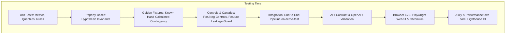

# Verification & Test Plan: Project Varsha

**Document Reference:** Varsha Comprehensive Test Plan  
**Version:** 1.0.0

---

## 1. Test Strategy & Quality Hierarchy

Varsha enforces a rigorous multi-tier testing strategy covering statistical correctness, physical plausibility, leakage prevention, API contracts, accessibility, and end-to-end user journeys.

---

## 2. Test Execution Commands & Directory Map

| Layer / Test Suite | Command | File Path / Target |
|---|---|---|
| **Unit Tests** | `pytest tests/unit/` | `tests/unit/` (metrics, alignment, rules, models, aggregation) |
| **Property-Based** | `pytest tests/property/` | `tests/property/` (Hypothesis bounds, monotone probabilities) |
| **Golden Fixtures** | `pytest tests/unit/test_golden_metrics.py` | Verified contingency and FSS numerical fixtures |
| **Controls & Canaries** | `pytest tests/controls/` | `tests/controls/` (positive control, negative control, canary leak) |
| **Integration Pipeline**| `pytest tests/integration/` | Full `demo-fast` pipeline execution and artifact inspection |
| **API Contract Tests** | `pytest tests/api/` | Schema validation, invalid query bounds, CORS/CSP |
| **Frontend Unit** | `pnpm --prefix web test` | Data transforms, binning, URL state management |
| **Playwright E2E** | `npx playwright test` | Multi-viewport console, district brief, verification routes |
| **Accessibility Audit**| `pnpm --prefix web test:a11y` | `@axe-core/playwright` on all routes across both themes |
| **Determinism Check** | `python scripts/verify_determinism.py` | Multi-run artifact SHA-256 hash comparison |
| **Docs Verification** | `python scripts/verify_docs.py` | Verify shell commands in README and all markdown links |

---

## 3. Specific Scientific Test Cases

### 3.1 Contingency & Continuous Metric Bounds (Property Tests)
- $\text{POD}, \text{FAR}, \text{CSI} \in [0, 1.0]$.
- $\text{ETS} \in [-1.0/3.0, 1.0]$ with perfect forecast scoring $1.0$ and random forecast scoring $0.0$.
- $\text{RMSE} \ge \text{MAE} \ge 0.0$.
- Probability Monotonicity: $\forall (s, t), \quad P(\ge 204.5) \le P(\ge 115.6) \le P(\ge 64.5)$.
- Quantile Non-Crossing: $\forall (s, t), \quad \hat{q}_{0.10} \le \hat{q}_{0.50} \le \hat{q}_{0.90}$.

### 3.2 Leakage Canaries
- **Future Observation Leakage:** Registering an observational precipitation variable at valid time $t_{\text{valid}}$ with $t_{\text{avail}} > t_{\text{init}}$ must throw `FeatureLeakageError`.
- **Target Shuffling Canary:** Shuffling season indices destroys B4's statistical advantage over B2 on test splits.

### 3.3 Positive & Negative Controls
- **Positive Control:** On synthetic data generated with `regime_dependent_bias: true`, Model B4 must achieve statistically superior ETS at $\ge 64.5\text{ mm}$ over B2 ($95\%$ bootstrap CI lower bound $> 0$).
- **Negative Control:** On synthetic data generated with `regime_dependent_bias: false`, Model B4 must **not** show statistically significant skill gain over B2 ($95\%$ bootstrap CI contains $0$).
